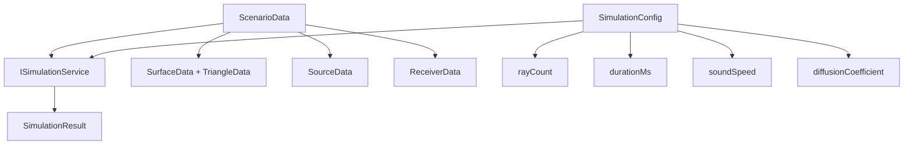
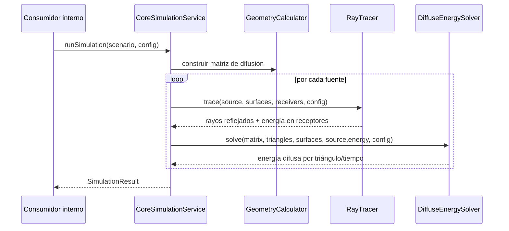

# Arquitectura del Core

El Core es la API interna de simulación acústica del proyecto. Vive en `src/core`, se compila como la librería estática `simulation_core` y no está diseñado como SDK externo instalable: sus contratos existen para que la GUI y las pruebas del repositorio ejecuten simulaciones sin depender de OpenGL.

## Rol dentro del sistema

| Elemento | Decisión |
|---|---|
| Módulo | `src/core` |
| Librería CMake | `simulation_core` |
| Namespace | `core::` |
| Consumidores | GUI, tests y utilidades internas del proyecto |
| No objetivo | API pública versionada, paquete instalable o dependencia de terceros |

La frontera principal del Core es `core::ISimulationService`. La GUI no consume sus tipos directamente desde pantallas; los adaptadores GUI-Core convierten entre dominio visual y datos de simulación.

## Contratos principales



| Tipo | Contenido |
|---|---|
| `ScenarioData` | Superficies, triángulos, fuentes y receptores. |
| `SourceData` | Posición y energía inicial de cada fuente. |
| `ReceiverData` | Posición y radio de captura del receptor. |
| `SimulationConfig` | Duración, velocidad del sonido, cantidad global de rayos y coeficiente difuso. |
| `SimulationResult` | Rayos reflejados, energía recibida, energía por triángulo, matrices difusas y totales. |

## Flujo de simulación



La simulación combina dos caminos complementarios:

1. **Ray tracing especular**: lanza rayos desde cada fuente, detecta intersecciones con triángulos, aplica absorción por superficie, calcula rebotes y registra energía cuando un rayo alcanza receptores.
2. **Energía difusa**: construye relaciones entre triángulos visibles, calcula distancias, tiempos y porcentajes, y propaga energía residual en el tiempo respetando absorción y límite temporal.

## Generación de rayos

`RayTracer` genera direcciones distribuidas sobre una esfera mediante subdivisión de icosaedro. El valor pedido en `SimulationConfig::rayCount` se ajusta al conteo válido más cercano de la forma:

```text
2 + 10 * n^2
```

Esto prioriza una distribución espacial regular sobre una coincidencia exacta con cualquier número arbitrario. La GUI muestra la cantidad configurada por el usuario, pero el Core puede ejecutar con el conteo ajustado internamente por la subdivisión.

## Energía y límites

| Parámetro | Fuente | Uso |
|---|---|---|
| Energía de fuente | `SourceData::energy` | Energía inicial que se reparte entre rayos y alimenta la simulación difusa. |
| Cantidad de rayos | `SimulationConfig::rayCount` | Configuración global de muestreo direccional para todas las fuentes. |
| Absorción | `SurfaceData::absorption` | Pérdida aplicada al impactar o propagar energía en superficies. |
| Duración | `SimulationConfig::durationMs` | Límite temporal; no se registran transiciones fuera del intervalo. |

## Reglas de dependencia

Permitido:

- `src/core` usa tipos y algoritmos propios.
- Tests pueden incluir headers del Core y enlazar `simulation_core`.
- La GUI puede invocar el Core desde adaptadores ubicados bajo `src/gui/services/implementations/core`.

Prohibido:

- Core depender de `src/gui`.
- Core depender de OpenGL, GLFW, GLAD o Dear ImGui.
- Pantallas GUI incluir o manipular tipos Core directamente.
- Tratar `simulation_core` como API externa estable fuera del repositorio.

## Referencias

- `docs/core-api.md` — guía de uso de la API interna.
- `docs/architecture/system-design.md` — visión global GUI → adaptadores → Core.
- `docs/project/adrs/0002-core-internal-api.md` — decisión arquitectónica del Core como API interna.
