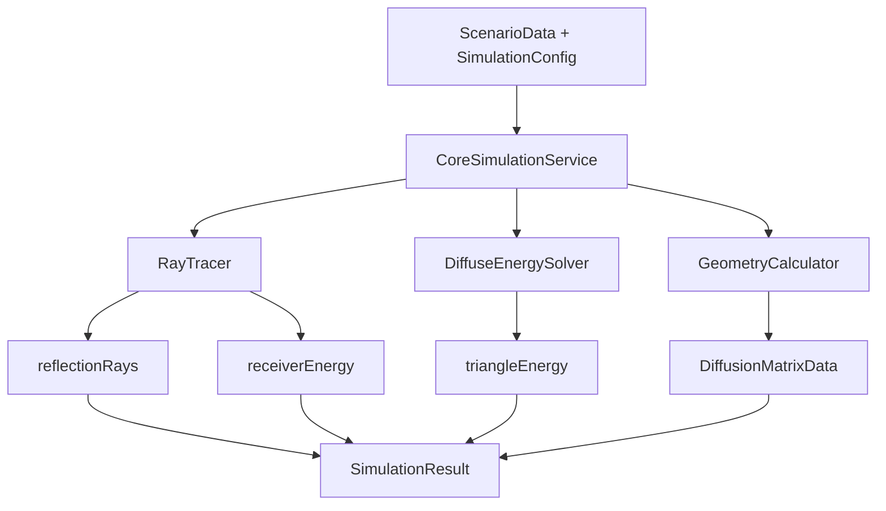

# Core API interna — Guía de uso

Todos los archivos del Core viven en `src/core/`, usan el namespace `core::` y se compilan dentro de la librería estática `simulation_core`.

Esta API es interna del proyecto. Está documentada para la GUI, tests y mantenimiento del repositorio; no es un SDK externo instalable ni un contrato versionado para otros proyectos.

---

## Cómo obtener el servicio

```cpp
#include "core/AppConfig.h"
#include "core/ServiceFactory.h"

core::AppConfig cfg = core::loadAppConfig(); // ServiceMode::Mock por defecto
auto service = core::ServiceFactory::createSimulationService(cfg);
```

Para usar el Core real en lugar del Mock:

```cpp
cfg.serviceMode = core::ServiceMode::Core;
```

En la aplicación GUI esta selección se encapsula en factories y adaptadores bajo `src/gui/services/implementations/core`; las pantallas no deberían construir servicios Core directamente.

---

## Cómo ejecutar una simulación completa

```cpp
#include "core/SimulationTypes.h"
#include "core/ServiceFactory.h"
#include "core/AppConfig.h"

// 1. Construir el escenario
core::ScenarioData scenario;

core::TriangleData tri;
tri.id        = 0;
tri.surfaceId = 0;
tri.a = {0.0, 0.0, 0.0};
tri.b = {3.0, 0.0, 0.0};
tri.c = {0.0, 3.0, 0.0};

core::SurfaceData surface;
surface.id         = 0;
surface.absorption = 0.2; // RF-15: absorción por superficie
surface.triangles.push_back(tri);
scenario.surfaces.push_back(surface);

core::SourceData source;
source.id       = 0;
source.position = {1.5, 1.5, 1.0};
source.energy   = 120.0;
scenario.sources.push_back(source);   // RF-14

core::ReceiverData receiver;
receiver.id       = 0;
receiver.position = {2.0, 2.0, 0.5};
receiver.radius   = 0.5;
scenario.receivers.push_back(receiver); // RF-14

// 2. Configurar la simulación
core::SimulationConfig config;
config.durationMs  = 1000;  // RF-10: límite temporal
config.soundSpeed  = 340.0; // RF-05
config.rayCount    = 642;

// 3. Ejecutar
auto service = core::ServiceFactory::createSimulationService(core::loadAppConfig());
core::SimulationResult result = service->runSimulation(scenario, config);

// 4. Usar resultados (RF-11)
if (result.success) {
    for (const auto& ray    : result.reflectionRays) { /* ray.from, ray.to, ray.energy, ray.timeMs */ }
    for (const auto& sample : result.receiverEnergy) { /* sample.receiverId, sample.timeMs, sample.energy */ }
    for (const auto& sample : result.triangleEnergy) { /* sample.triangleId, sample.timeMs, sample.energy */ }
}
```

`rayCount` es una configuración global de la simulación. `RayTracer` genera direcciones por subdivisión de icosaedro, por lo que ajusta el valor pedido a un conteo válido de la forma `2 + 10*n^2`.

---

## Flujo interno



## Funciones por requerimiento

### RF-01 — Identificación de triángulos

Los triángulos se definen en `ScenarioData::surfaces` y el core los procesa automáticamente
al llamar `runSimulation`. No se necesita ninguna llamada adicional.

```cpp
// Los triángulos llegan al core dentro de SurfaceData
core::TriangleData tri;
tri.id = 0; tri.surfaceId = 0;
tri.a = {x1,y1,z1}; tri.b = {x2,y2,z2}; tri.c = {x3,y3,z3};
surface.triangles.push_back(tri);
```

---

### RF-02 — Centroide de cada triángulo

```cpp
#include "core/GeometryCalculator.h"

core::Vec3 centro = core::GeometryCalculator::centroid(tri);
// centro.x, centro.y, centro.z
```

---

### RF-03 — Distancia entre superficies

```cpp
core::Vec3 ca = core::GeometryCalculator::centroid(triA);
core::Vec3 cb = core::GeometryCalculator::centroid(triB);
double dist   = core::GeometryCalculator::distance(ca, cb);
```

---

### RF-04 — Visibilidad entre triángulos

```cpp
bool visibles = core::GeometryCalculator::areVisible(triA, triB);
// false si son coplanares o no se enfrentan
```

---

### RF-05 — Tiempo de vuelo

```cpp
double dist  = core::GeometryCalculator::distance(ca, cb);
int    tmsMs = core::GeometryCalculator::timeOfFlightMs(dist, 340.0);
// resultado en milisegundos
```

---

### RF-06 — Porcentajes de distribución

Los porcentajes se calculan automáticamente dentro de `buildDiffusionMatrix`.
Cada triángulo distribuye su energía en partes iguales entre sus vecinos visibles.

```cpp
core::DiffusionMatrixData matrix =
    core::GeometryCalculator::buildDiffusionMatrix(triangulos, 340.0);

// matrix.percentages[i][j] = fracción que i envía a j
// matrix.visibility[i][j]  = true si se ven entre sí
// matrix.distances[i][j]   = distancia en metros
// matrix.timesMs[i][j]     = tiempo de vuelo en ms
```

---

### RF-07 — Distribución de energía difusa

```cpp
#include "core/DiffuseEnergySolver.h"

auto muestras = core::DiffuseEnergySolver::solve(
    matrix,       // DiffusionMatrixData de buildDiffusionMatrix
    triangulos,   // vector<TriangleData>
    superficies,  // vector<SurfaceData> (para leer absorción)
    energiaInicial,
    config
);

for (const auto& m : muestras) {
    // m.triangleId, m.timeMs, m.energy
}
```

---

### RF-08 — Absorción de energía

La absorción se aplica automáticamente en `DiffuseEnergySolver::solve` y en `RayTracer::trace`
usando `SurfaceData::absorption` de cada superficie.

```cpp
surface.absorption = 0.3; // 30% de la energía se absorbe en cada rebote
```

---

### RF-09 — Transmisión hacia receptores

```cpp
#include "core/RayTracer.h"

auto traceOut = core::RayTracer::trace(source, surfaces, receivers, config);

for (const auto& sample : traceOut.receiverEnergy) {
    // sample.receiverId, sample.timeMs, sample.energy
}
```

`RayTracer` reparte `SourceData::energy` entre las direcciones generadas. En cada impacto aplica absorción de superficie, registra segmentos de reflexión y descuenta la porción destinada a difusión según `SimulationConfig::diffusionCoefficient`.

---

### RF-10 — Límite temporal

```cpp
config.durationMs = 1000; // ninguna transición se registra después de 1000 ms
```

---

### RF-11 — Resultados para análisis

`SimulationResult` contiene todo lo necesario para el informe académico:

| Campo | Contenido |
|---|---|
| `reflectionRays` | Segmentos de rayo con energía y tiempo |
| `receiverEnergy` | Energía recibida por receptor por instante |
| `triangleEnergy` | Energía en cada triángulo por instante |
| `diffusion` | Matrices de distancia, tiempo, visibilidad y porcentaje |
| `totalReceiverEnergy` | Suma total de energía recibida |
| `lostEnergy` | Energía que no llegó a ningún receptor |

---

## Archivos del core

| Archivo | Contiene |
|---|---|
| `SimulationTypes.h` | Todos los tipos de datos compartidos |
| `ISimulationService.h` | Interfaz que consume la GUI |
| `ServiceMode.h` | Enum Mock / Core |
| `AppConfig.h/.cpp` | Configuración global |
| `ServiceFactory.h/.cpp` | Crea Mock o Core según config |
| `GeometryCalculator.h/.cpp` | RF-02 a RF-06 |
| `RayTracer.h/.cpp` | RF-07, RF-08, RF-09, RF-10 |
| `DiffuseEnergySolver.h/.cpp` | RF-07, RF-08, RF-10 |
| `CoreSimulationService.h/.cpp` | Orquesta todo (RF-01 a RF-11) |
| `MockSimulationService.h/.cpp` | Datos falsos para desarrollo GUI |

## Integración desde GUI

La GUI debe entrar al Core por adaptadores, no desde pantallas:

| GUI | Core |
|---|---|
| `GuiScenario::planes` | `core::SurfaceData` + `core::TriangleData` |
| `GuiScenario::sources` | `core::SourceData` |
| `GuiScenario::receivers` | `core::ReceiverData` |
| `GuiScenario::simulationConfig.rayCount` | `core::SimulationConfig::rayCount` |
| `SimulationResultDto` | Resultado mapeado desde `core::SimulationResult` |

Los mappers viven en `src/gui/services/implementations/core/mappers` para evitar que los tipos `core::` se filtren hacia `src/gui/screens`, `src/gui/entities` o interfaces públicas GUI.
