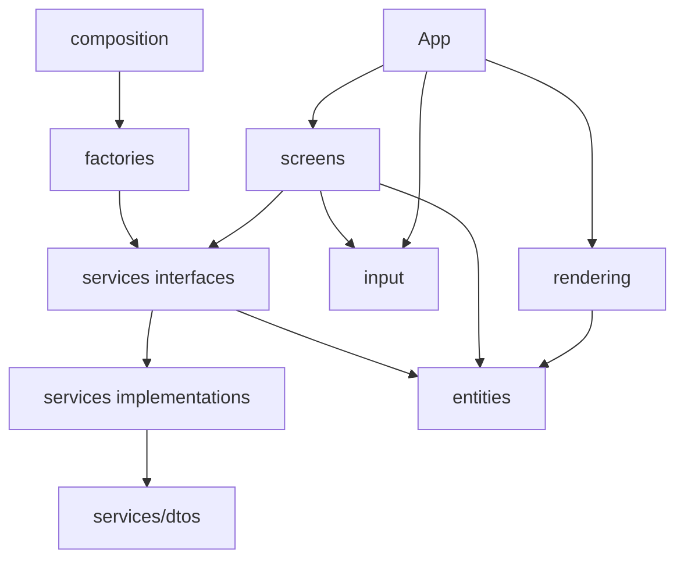
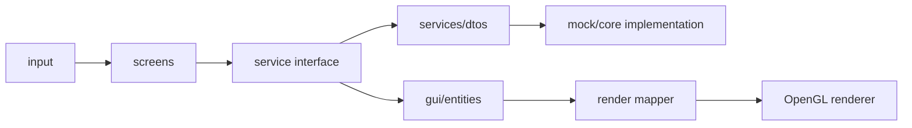
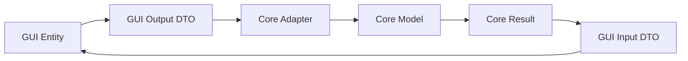
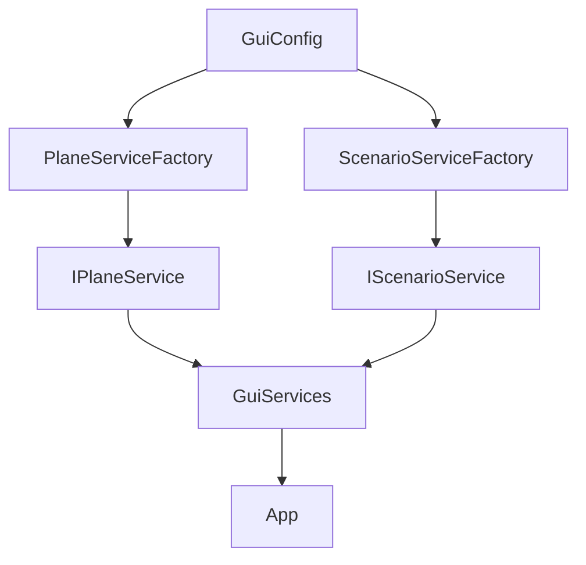
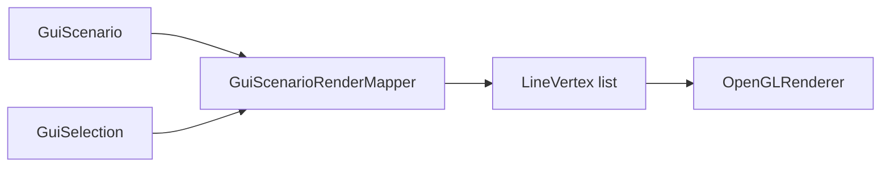

# Arquitectura GUI

La GUI usa una Clean Architecture propia dentro de `src/gui`. Su objetivo es permitir que la interfaz avance de forma independiente del Core real, sin duplicar reglas internas de simulacion ni filtrar tipos del Core hacia las pantallas.

## Decision Principal

Todas las capas de la GUI usan el dominio visual ubicado en `src/gui/entities`. Cualquier dato externo debe adaptarse a ese dominio antes de ser usado por pantallas o rendering.



## Capas

| Capa | Responsabilidad |
|---|---|
| `entities` | Dominio visual de la GUI. Define los objetos que la interfaz entiende y manipula. |
| `services/dtos` | Datos de frontera para entradas y salidas hacia implementaciones externas o futuras integraciones con Core. |
| `services` | Contratos que las pantallas consumen. Ocultan si la implementacion es mock o core. |
| `services/implementations/mock` | Implementaciones temporales para desarrollar GUI sin esperar al Core. |
| `services/implementations/core` | Adaptadores futuros hacia el Core real. No deben filtrar tipos del Core a la GUI. |
| `factories` | Deciden que implementacion usar segun `gui/config`. |
| `composition` | Crea los servicios una sola vez e inyecta dependencias en `App`. |
| `screens` | Flujos visuales por pantalla. Orquestan input, servicios y datos de dominio. |
| `rendering` | OpenGL, tipos renderizables y mapeo del dominio GUI hacia vertices. |
| `input` | Estado de teclado/camara y abstracciones de entrada. |

## Flujo De Dependencias



La direccion importante es hacia el dominio GUI. Las pantallas no deben depender de clases internas del Core. El renderer tampoco debe construir reglas de escenario: solo convierte datos ya preparados a OpenGL.

## Frontera Con Core



Los DTOs no son el dominio de la GUI. Son formatos de intercambio. La GUI debe adaptar esos datos antes de usarlos en pantallas o renderizado.

## Composition Root

`src/gui/composition` es el punto donde se crean los servicios GUI. Evita que cada pantalla decida manualmente si usa mock o core.



Regla:

- Los factories deciden implementacion.
- Composition crea objetos.
- App recibe dependencias ya construidas.
- Las pantallas consumen interfaces, no implementaciones concretas.

## Pantallas

Las pantallas se organizan por flujo funcional:

```text
src/gui/screens/
  preparation/
  simulation/
  components/
```

Cada pantalla debe concentrar la coordinacion visual de su flujo. Los componentes compartidos entre pantallas viven en `screens/components`.

En C++/OpenGL estos componentes no funcionan como React. Son clases o funciones que participan del ciclo explicito de la aplicacion:

```cpp
screen.update(input, deltaTime);
screen.render(renderer);
```

## Rendering

`src/gui/rendering` contiene OpenGL y conversiones hacia datos renderizables.



Reglas:

- El renderer no decide reglas de negocio visual.
- El renderer no debe conocer servicios.
- Los shaders, VAO, VBO y estado OpenGL se mantienen en rendering.
- El mapeo de dominio a vertices vive fuera de `OpenGLRenderer`.

## Servicios GUI

Los servicios GUI son frontera de la interfaz, no servicios globales del sistema.

Ejemplo conceptual:

```cpp
class IPlaneService {
public:
    virtual ~IPlaneService() = default;
    // Operaciones sobre el dominio GUI usando DTOs cuando cruzan fronteras.
};
```

Cuando exista integracion real, `CorePlaneService` debe adaptar entre:

- `gui/entities` y `gui/services/dtos`.
- `gui/services/dtos` y tipos internos del Core.

La GUI nunca debe incluir directamente los headers del minicore.

## Reglas

Permitido:

- Screens usan `entities`, `services`, `input` y componentes.
- Rendering usa `entities` y tipos de render.
- Services usan `entities` y DTOs.
- Factories conocen implementaciones concretas.
- Composition conoce factories y servicios concretos.

Prohibido:

- `entities` depender de OpenGL.
- `entities` depender de servicios.
- `rendering` llamar servicios.
- Screens incluir clases internas del Core.
- GUI incluir archivos de `workspace/core-initial`.
- Core depender de GUI.

## Estado Actual Y Siguiente Paso

La GUI ya esta separada en capas y puede funcionar con servicios mock. El siguiente paso arquitectonico es implementar adaptadores reales hacia el Core cuando el minicore sea convertido desde consola a una API usable desde memoria.

Los detalles temporales de interaccion visual no se documentan aqui porque no forman parte estable de la arquitectura.
