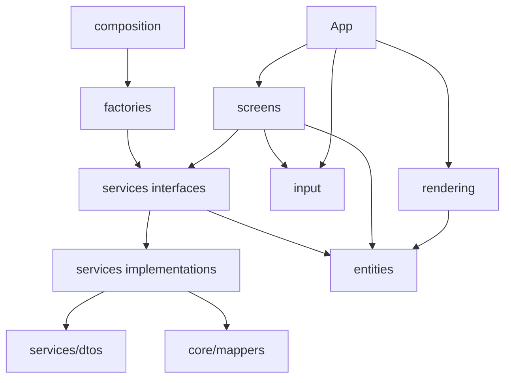
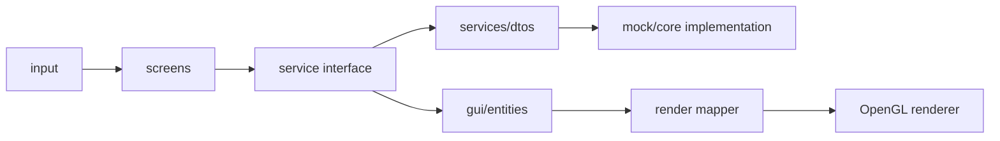
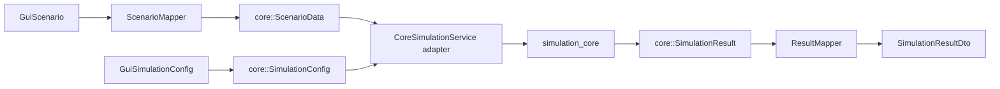
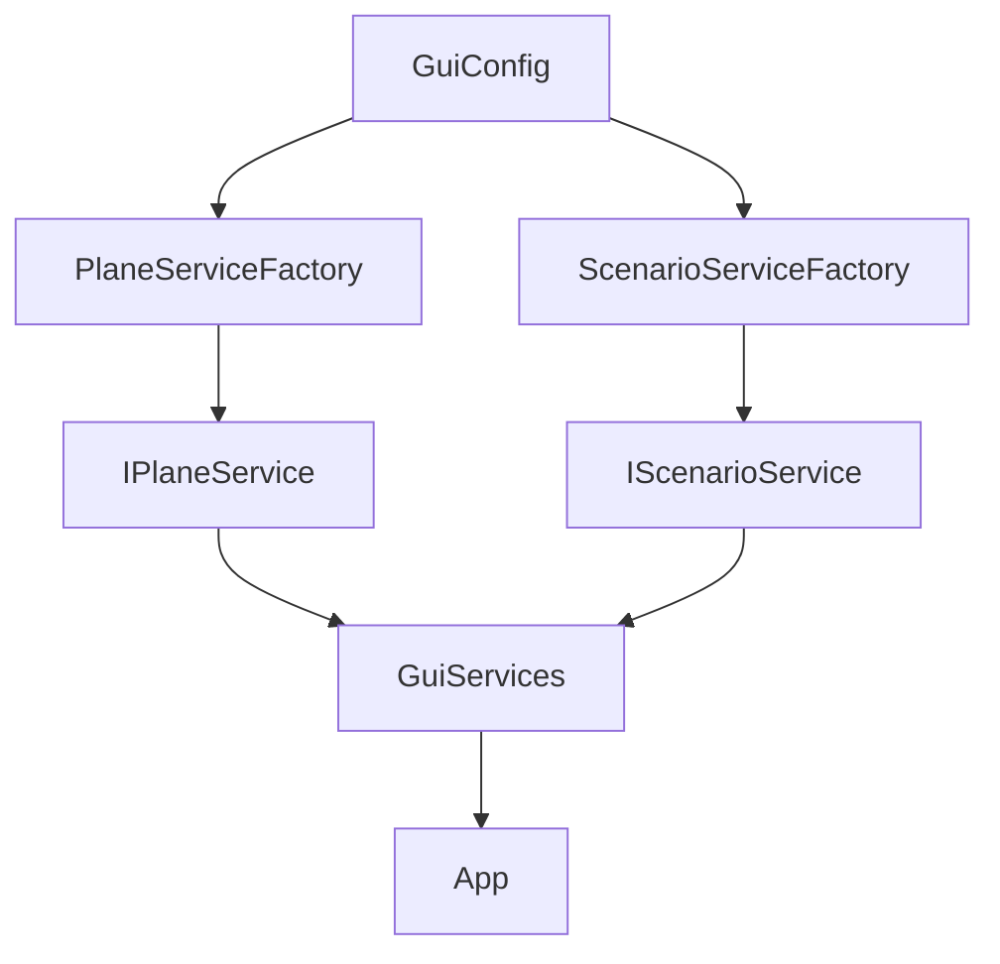
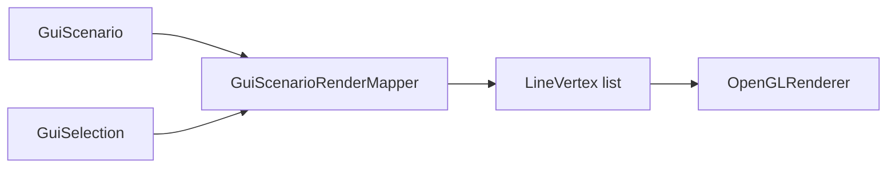

# Arquitectura GUI

La GUI usa una Clean Architecture propia dentro de `src/gui`. Su objetivo es separar el dominio visual de la simulación acústica real: las pantallas editan y muestran un `GuiScenario`, mientras los servicios y adaptadores deciden si la operación se resuelve con mock data o con `simulation_core`.

## Decisión principal

Todas las capas de la GUI usan el dominio visual ubicado en `src/gui/entities`. Cualquier dato externo se adapta antes de ser usado por pantallas o rendering, y ningún contrato público GUI expone tipos `core::`.



## Capas

| Capa | Responsabilidad |
|---|---|
| `entities` | Dominio visual de la GUI. Define los objetos que la interfaz entiende y manipula. |
| `services/dtos` | Datos de frontera para entradas y salidas hacia implementaciones mock o Core. |
| `services` | Contratos que las pantallas consumen. Ocultan si la implementacion es mock o core. |
| `services/implementations/mock` | Implementaciones temporales para desarrollar GUI sin esperar al Core. |
| `services/implementations/core` | Adaptadores hacia el Core real. Usan mappers internos y no filtran tipos del Core a la GUI. |
| `factories` | Deciden que implementacion usar segun `gui/config`. |
| `composition` | Crea los servicios una sola vez e inyecta dependencias en `App`. |
| `screens` | Flujos visuales por pantalla. Orquestan input, servicios y datos de dominio. |
| `rendering` | OpenGL, tipos renderizables y mapeo del dominio GUI hacia vertices. |
| `input` | Estado de teclado/camara y abstracciones de entrada. |

## Flujo De Dependencias



La direccion importante es hacia el dominio GUI. Las pantallas no deben depender de clases internas del Core. El renderer tampoco debe construir reglas de escenario: solo convierte datos ya preparados a OpenGL.

## Frontera con Core



Los DTOs no son el dominio de la GUI. Son formatos de intercambio entre servicios y pantallas. Los mappers bajo `src/gui/services/implementations/core/mappers` son el único lugar donde se traduce entre `gui::` y `core::`.

## Configuración de simulación en GUI

`GuiScenario` contiene `simulationConfig` para parámetros que pertenecen al escenario preparado, no a una pantalla concreta.

| Control GUI | Dominio GUI | Mapeo al Core | Nota |
|---|---|---|---|
| `General / Number of rays` | `GuiScenario::simulationConfig.rayCount` | `core::SimulationConfig::rayCount` | El Core ajusta internamente el conteo a `2 + 10*n^2` por subdivisión icosaédrica. |
| `Source / Energy` | `GuiSource::energy` | `core::SourceData::energy` | Valor inicial por fuente; el default visual es `120`. |
| Velocidad de simulación | Estado de `SimulationScreen` | No cambia el cálculo Core | Controla la reproducción visual entre `0.001x` y `2x`. |

Esta separación evita que un ajuste visual se confunda con un parámetro físico de simulación.

## Composition Root

`src/gui/composition` es el punto donde se crean los servicios GUI. Evita que cada pantalla decida manualmente si usa mock o core.



Regla:

- Los factories deciden implementacion.
- Composition crea objetos.
- App recibe dependencias ya construidas.
- Las pantallas consumen interfaces, no implementaciones concretas.

## Pantallas

Las pantallas se organizan por flujo funcional:

```text
src/gui/screens/
  preparation/
  simulation/
  components/
```

Cada pantalla debe concentrar la coordinacion visual de su flujo. Los componentes compartidos entre pantallas viven en `screens/components`.

La preparación concentra edición y configuración:

- `GeneralPropertiesPanel`: parámetros globales del escenario, incluyendo `Number of rays`.
- `SourcePropertiesPanel`: posición y energía inicial de la fuente.
- Paneles de planos y receptores: geometría, absorción y ubicación.

La simulación consume un escenario ya preparado, muestra rayos/resultados y permite controlar la velocidad de reproducción sin reescribir el escenario.

En C++/OpenGL estos componentes no funcionan como React. Son clases o funciones que participan del ciclo explicito de la aplicacion:

```cpp
screen.update(input, deltaTime);
screen.render(renderer);
```

## Rendering

`src/gui/rendering` contiene OpenGL y conversiones hacia datos renderizables.



Reglas:

- El renderer no decide reglas de negocio visual.
- El renderer no debe conocer servicios.
- Los shaders, VAO, VBO y estado OpenGL se mantienen en rendering.
- El mapeo de dominio a vertices vive fuera de `OpenGLRenderer`.
- Los marcadores visuales de fuente y receptor usan icosaedros orientados sobre el eje Z para mantener una convención consistente con el resto de la escena.

## Servicios GUI

Los servicios GUI son frontera de la interfaz, no servicios globales del sistema.

Ejemplo conceptual:

```cpp
class IPlaneService {
public:
    virtual ~IPlaneService() = default;
    // Operaciones sobre el dominio GUI usando DTOs cuando cruzan fronteras.
};
```

Las implementaciones Core adaptan entre:

- `gui/entities` y `gui/services/dtos`.
- `gui/services/dtos` y tipos internos del Core.

La GUI puede incluir headers del Core únicamente dentro de `services/implementations/core` y sus mappers. Las pantallas, entidades y contratos de servicios deben mantenerse sobre tipos GUI.

## Reglas

Permitido:

- Screens usan `entities`, `services`, `input` y componentes.
- Rendering usa `entities` y tipos de render.
- Services usan `entities` y DTOs.
- Factories conocen implementaciones concretas.
- Composition conoce factories y servicios concretos.

Prohibido:

- `entities` depender de OpenGL.
- `entities` depender de servicios.
- `rendering` llamar servicios.
- Screens incluir clases internas del Core.
- Interfaces públicas GUI devolver tipos `core::`.
- Core depender de GUI.

## Estado actual

La GUI está separada en capas, puede funcionar con servicios mock y puede ejecutar el Core mediante adaptadores. La integración actual mantiene la frontera limpia: `CoreSimulationService` construye `core::SimulationConfig`, usa mappers para escenario/resultados y devuelve `SimulationResultDto` a la pantalla.

Los detalles visuales finos se documentan solo cuando afectan contratos o decisiones arquitectónicas; los valores de interfaz que cambian la simulación sí quedan registrados aquí para mantener trazabilidad entre GUI y Core.
