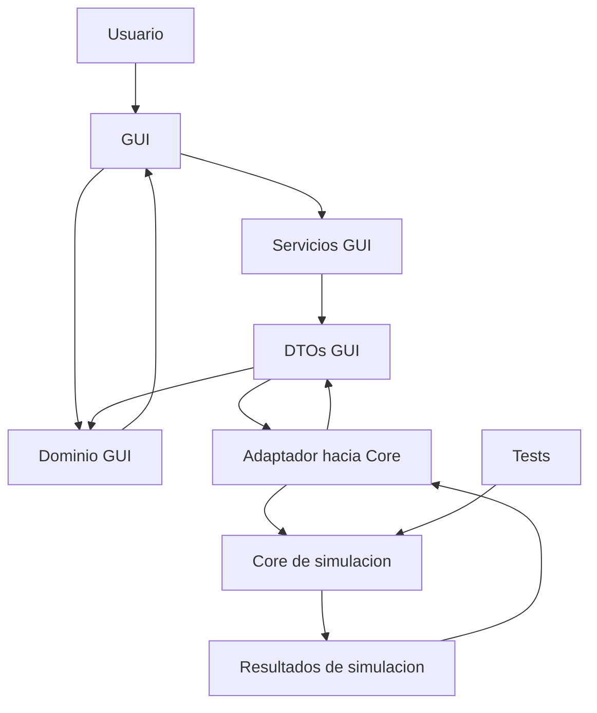
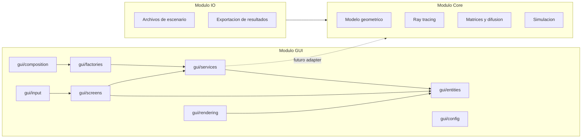
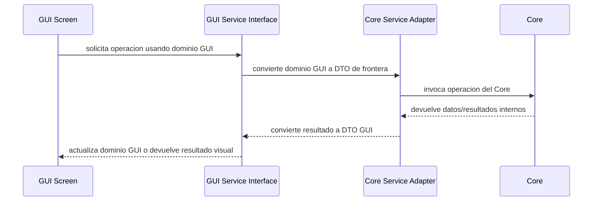
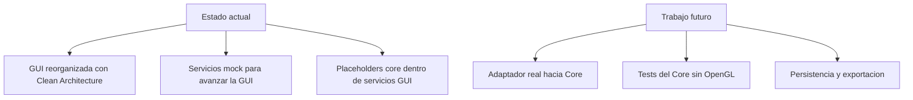

# Diseño del Sistema

Este documento describe la arquitectura general del simulador acustico 3D. La decision principal es separar GUI, Core y Tests para que cada area pueda avanzar sin depender de detalles internos de las otras.

La GUI usa una Clean Architecture propia dentro de `src/gui`. Esa arquitectura no reemplaza al Core: define como la GUI organiza su dominio visual, sus pantallas, sus servicios internos y sus futuros adaptadores hacia el Core.

## Vista General



## Responsabilidades

| Area | Responsabilidad | No debe encargarse de |
|---|---|---|
| GUI | Visualizacion 3D, pantallas, input, dominio visual y adaptacion de datos para renderizar | Calculos fisicos, ray tracing real o reglas internas del Core |
| Core | Simulacion acustica, geometria real, ray tracing, difusion, matrices y resultados | Ventanas, OpenGL, controles visuales o estado de pantallas |
| Tests | Validar reglas del Core y contratos estables | Abrir ventanas o depender de OpenGL |

## Arquitectura General



## Estructura Recomendada

```text
src/
  gui/
    App.h
    App.cpp
    AppMode.h

    entities/
      GuiScenario.h
      GuiPlane.h
      GuiTriangle.h
      GuiSource.h
      GuiReceiver.h
      GuiSelection.h

    config/
      GuiConfig.h
      GuiServiceProvider.h

    services/
      dtos/
        PlaneDtos.h
        ScenarioDtos.h
        SimulationDtos.h
      IPlaneService.h
      IScenarioService.h
      ISimulationService.h
      implementations/
        mock/
        core/

    factories/
      PlaneServiceFactory.h
      ScenarioServiceFactory.h

    composition/
      GuiComposition.h
      GuiServices.h

    screens/
      preparation/
      simulation/
      components/

    rendering/
      OpenGLRenderer.h
      RenderTypes.h
      GuiScenarioRenderMapper.h

    input/
      InputState.h
      CameraController.h

  core/
    scenario/
    simulation/
    geometry/
    raytracing/
    diffusion/

  io/
    ScenarioFile.h
    ResultExporter.h

tests/
  core/
  fixtures/

workspace/
  core-initial/
```

## GUI Como Clean Architecture

La GUI tiene su propia arquitectura porque necesita avanzar aunque el Core real todavia este en adaptacion. Las capas internas de la GUI viven dentro de `src/gui` y no son servicios globales del sistema.

Regla central:

- Todas las capas de la GUI trabajan con `gui/entities` como dominio visual.
- Todo dato que entra desde afuera debe adaptarse a `gui/entities`.
- Todo dato que sale hacia afuera debe convertirse desde `gui/entities` hacia DTOs.
- La GUI no debe incluir tipos internos del Core ni archivos de `workspace/core-initial`.

Mas detalle: `docs/architecture/gui/README.md`.

## Relacion Entre GUI y Core



El Core puede usar clases, POO y estructuras propias como las que existen en `workspace/core-initial`. Esa implementacion queda encapsulada detras de adaptadores. La GUI no debe conocer `room`, `plane`, `triangle`, `source`, `receptor` ni punteros dinamicos del Core.

## Reglas De Dependencia

Permitido:

- `gui/screens` puede depender de `gui/entities`, `gui/services`, `gui/input` y `gui/rendering`.
- `gui/rendering` puede depender de `gui/entities` y tipos de render.
- `gui/services` puede depender de `gui/entities` y `gui/services/dtos`.
- `gui/factories` puede depender de `gui/config` e implementaciones de servicios GUI.
- `gui/composition` puede construir servicios y pasarlos a `App`.
- El Core puede depender de sus propios tipos y algoritmos.

Prohibido:

- Core depender de `gui`.
- Core depender de OpenGL, GLFW o GLAD.
- Tests del Core depender de GUI/OpenGL.
- GUI incluir archivos de `workspace/core-initial`.
- Pantallas GUI usar directamente clases internas del Core.

## Integracion Con `workspace/core-initial`

El minicore en `workspace/core-initial` sirve como referencia funcional para la futura implementacion real. Contiene conceptos que deben preservarse:

- Sala, planos, triangulos, fuentes y receptores.
- Generacion de triangulos dentro de planos.
- Ray tracing y reflexiones.
- Matrices de distancia, tiempo, visibilidad y porcentajes.
- Energia difusa por triangulo y tiempo.
- Energia recibida por receptor.

La adaptacion futura debe eliminar dependencias de consola, variables globales y escritura directa de archivos durante el calculo. El resultado debe volver en memoria mediante contratos estables.

## Estado Actual



La GUI ya esta preparada para consumir servicios mock o core mediante factories y composition. La integracion real con el Core queda para una fase posterior.
