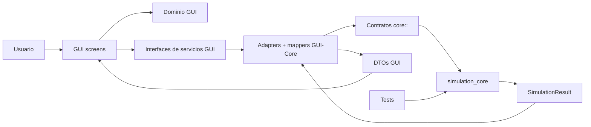
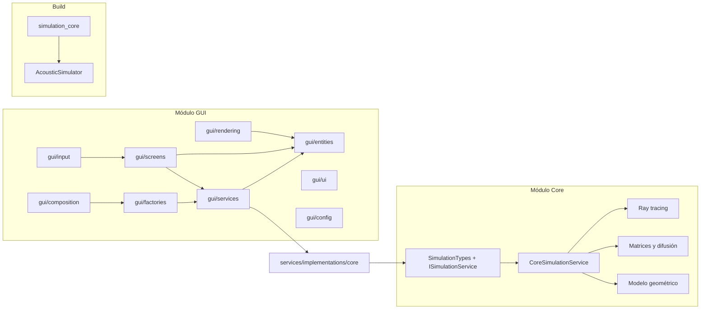
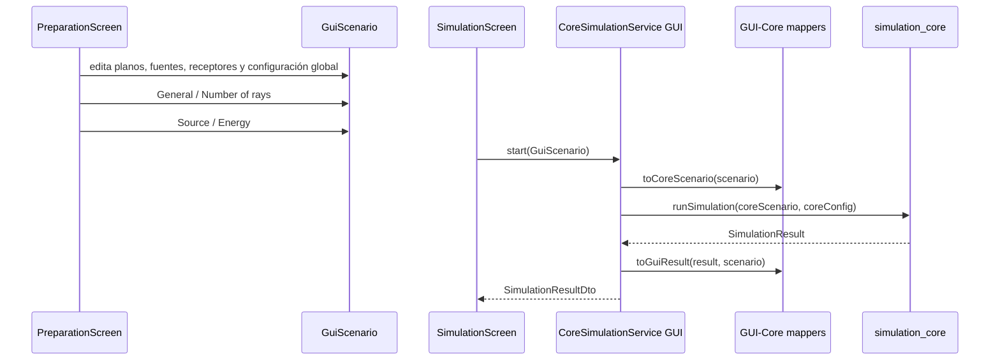
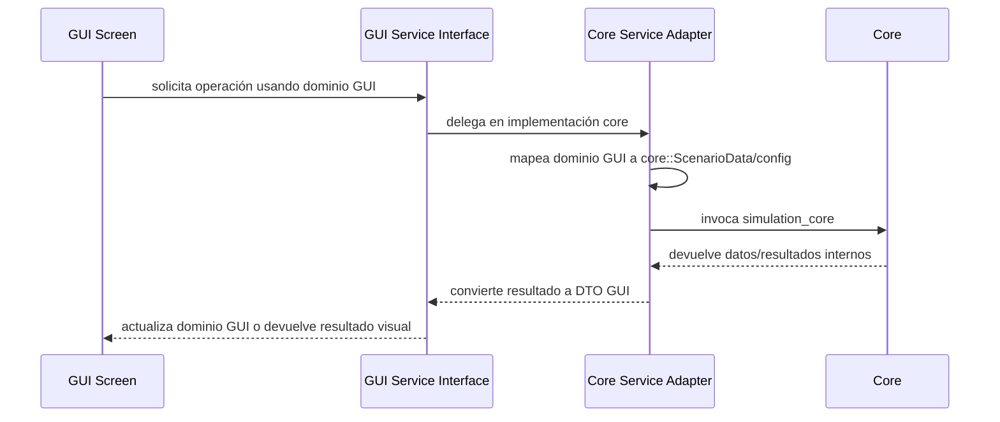
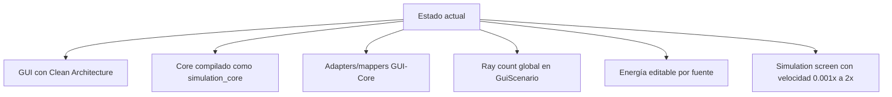

# Diseño del Sistema

El simulador acústico 3D está organizado en dos módulos principales: una GUI orientada a interacción y visualización, y un Core interno orientado a cálculo. La integración se hace mediante adaptadores y mappers para que las pantallas no conozcan tipos internos del Core y el Core no dependa de OpenGL ni de la interfaz.

## Vista general



## Responsabilidades

| Área | Responsabilidad | No debe encargarse de |
|---|---|---|
| GUI | Visualización 3D, edición del escenario, configuración de simulación, input, pantallas y dominio visual. | Cálculo físico, ray tracing real o reglas internas del Core. |
| Adaptadores GUI-Core | Convertir `GuiScenario`/DTOs a `core::ScenarioData` y `core::SimulationConfig`, ejecutar el Core y mapear resultados a DTOs GUI. | Filtrar tipos Core hacia contratos públicos de la GUI. |
| Core | Simulación acústica, geometría, ray tracing, difusión, matrices y resultados. | Ventanas, OpenGL, ImGui, controles visuales o estado de pantallas. |
| Tests | Validar reglas del Core y contratos estables. | Abrir ventanas o depender de OpenGL. |

## Arquitectura general



## Estructura actual

```text
src/
  gui/
    App.h
    App.cpp
    AppMode.h

    entities/
      GuiScenario.h
      GuiPlane.h
      GuiTriangle.h
      GuiSource.h
      GuiReceiver.h
      GuiSelection.h

    config/
      GuiConfig.h
      GuiServiceProvider.h

    services/
      dtos/
        PlaneDtos.h
        ScenarioDtos.h
        SimulationDtos.h
      IPlaneService.h
      IScenarioService.h
      ISimulationService.h
      implementations/
        mock/
        core/
          mappers/

    factories/
      PlaneServiceFactory.h
      ScenarioServiceFactory.h

    composition/
      GuiComposition.h
      GuiServices.h

    screens/
      preparation/
      simulation/
      components/

    rendering/
      OpenGLRenderer.h
      RenderTypes.h
      GuiScenarioRenderMapper.h

    input/
      InputState.h
      CameraController.h

  core/
    SimulationTypes.h
    ISimulationService.h
    ServiceFactory.h/.cpp
    CoreSimulationService.h/.cpp
    MockSimulationService.h/.cpp
    GeometryCalculator.h/.cpp
    RayTracer.h/.cpp
    DiffuseEnergySolver.h/.cpp

tests/
  core/
```

## Flujo de simulación integrado



La configuración global de rayos vive en `GuiScenario::simulationConfig` y se pasa a `core::SimulationConfig::rayCount`. La energía editable de cada fuente se mapea a `core::SourceData::energy`. La pantalla de simulación controla solo la reproducción visual del resultado; su velocidad de reproducción puede variar entre `0.001x` y `2x` sin cambiar el cálculo físico ya producido por el Core. El control usa escala logarítmica para priorizar velocidades pequeñas y permite entrada manual para valores precisos.

## GUI como Clean Architecture

La GUI tiene su propia arquitectura porque su dominio visual no es igual al dominio de cálculo. Las capas internas de la GUI viven dentro de `src/gui` y no son servicios globales del sistema.

Regla central:

- Todas las capas de la GUI trabajan con `gui/entities` como dominio visual.
- Todo dato que entra desde afuera debe adaptarse a `gui/entities`.
- Todo dato que sale hacia afuera debe convertirse desde `gui/entities` hacia DTOs.
- La GUI no debe exponer tipos internos del Core desde sus contratos públicos.

Más detalle: `docs/architecture/gui/README.md`.

## Relación entre GUI y Core



El Core usa tipos propios bajo `namespace core`. Esa implementación queda encapsulada detrás de adaptadores ubicados en `src/gui/services/implementations/core` y mappers en `src/gui/services/implementations/core/mappers`.

## Core como API interna

`simulation_core` es una librería interna del repositorio. Su API se documenta para consumo de la GUI y tests, no como contrato externo instalable. El Core procesa:

- Escenario: superficies, triángulos, fuentes y receptores.
- Fuente: posición y energía inicial.
- Configuración: duración, velocidad del sonido, ray count global y coeficiente difuso.
- Resultado: rayos reflejados, energía en receptores, energía por triángulo y matrices difusas.

La generación de rayos se basa en subdivisión de icosaedro. Por esa razón, el conteo pedido se ajusta internamente a `2 + 10*n^2` para mantener una distribución regular sobre la esfera.

## Reglas de dependencia

Permitido:

- `gui/screens` puede depender de `gui/entities`, `gui/services`, `gui/input` y `gui/rendering`.
- `gui/rendering` puede depender de `gui/entities` y tipos de render.
- `gui/services` puede depender de `gui/entities` y `gui/services/dtos`.
- `gui/services/implementations/core` puede depender de `core::` y de mappers internos de integración.
- `gui/factories` puede depender de `gui/config` e implementaciones de servicios GUI.
- `gui/composition` puede construir servicios y pasarlos a `App`.
- El Core puede depender de sus propios tipos y algoritmos.

Prohibido:

- Core depender de `gui`.
- Core depender de OpenGL, GLFW o GLAD.
- Tests del Core depender de GUI/OpenGL.
- Pantallas GUI usar directamente clases internas del Core.
- Contratos públicos GUI devolver tipos `core::`.

## Estado actual



La GUI consume servicios mock o core mediante factories y composition. Cuando se usa el modo Core, la integración pasa por adaptadores y mappers; cuando se usa el modo Mock, las pantallas siguen consumiendo los mismos contratos GUI.

## Más detalle

- Core: `docs/architecture/core/README.md`
- GUI: `docs/architecture/gui/README.md`
- Uso interno del Core: `docs/core-api.md`
- Decisiones arquitectónicas: `docs/project/adrs/`
